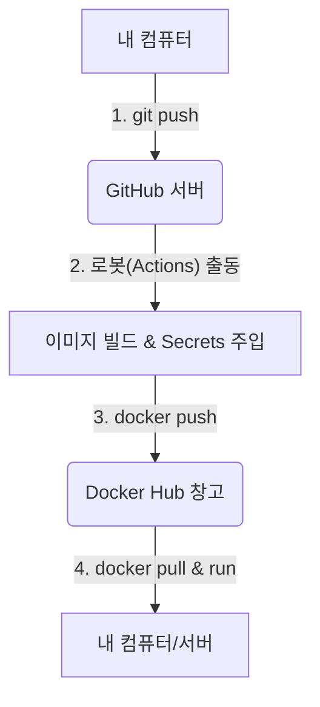

# 3. 자동화 배포(CI/CD)의 모든 것 (The Ultimate Guide)

---

## 🗺️ PART 1. 전체 흐름도 (The Road of Automation)
이 시스템은 크게 4개의 정거장을 거치는 **자동화 기차**

---

## 🚉 PART 2. 각 정거장별 상세 해부

### [1번 정거장] 내 컴퓨터 (Local Environment)
- **행위**: `git push origin main`
- **상세**: 내가 수정한 코드들이 GitHub이라는 원격 저장소로 업로드 
- **특징**: `.env` 파일은 `.gitignore`에 걸려있어 GitHub에 업로드 X (보안)

### [2번 정거장] GitHub Actions (CI - Continuous Integration)
- **정체**: GitHub에서 우리 대신 일을 해주는 **'버추얼 로봇'**
- **명령서 (`deploy.yml`)**: 로봇은 이 파일을 읽고 움직임
  - **`on: push`**: "Push가 들어오면 바로 일을 시작해!"라는 뜻
  - **`build-args`**: 빌드할 때 GitHub Secrets에서 꺼내온 API 키(Supabase 등)를 이미지 안에 **영구적으로 심어주는** 아주 중요한 단계
  - **결과**: `thdgywns2300/bookshelf-prod:latest`라는 이름의 완벽한 실행 파일(이미지)이 탄생

### [3번 정거장] Docker Hub (Image Registry)
- **정체**: 전 세계 누구나 이미지를 가져가거나 올릴 수 있는 **'중앙 물류 센터'**
- **`latest` 이름표의 비밀**: 
  - 우리가 `deploy.yml`에 적어둔 대로 로봇은 이미지에 **`latest`**라는 태그를 붙임
  - 새로운 이미지가 오면, 기존의 `latest` 이름표는 **자동으로 예전 것에서 떨어져서 새것에 붙음** (덮어쓰기 효과)

### [4번 정거장] 다시 내 컴퓨터 (Deployment)
- **명령 1 (`docker pull`)**: 물류 센터에서 "가장 최신판(`latest`) 가져와!"라고 지시
- **명령 2 (`docker rm -f`)**: 이미 실행 중인 '예전 버전' 컨테이너를 강제로 끄고 지움
- **명령 3 (`docker run`)**: 방금 가져온 '최신 버전' 이미지로 새 컨테이너를 띄움

---

## 🧐 PART 3. 우리가 함께 해결한 궁금증들 (Deep Dive Q&A)

### 🏷️ 1. `latest` 이름표는 GitHub이 마음대로 짓나요?
**Nope!**
GitHubActions는 우리가 만든 `.yml` 파일 속의 이름표를 그대로 받아 적을 뿐. 우리가 만약 `tags: ...:v2`라고 고치면, 그날부터 Docker Hub에는 온통 `v2`만 쌓이게 됨. **모든 제어권은 우리(개발자)에게 존재**

### 🥨 2. 파일 이름 끝에 `.prod`는 왜 붙이나요?
**`Production` (실제 서비스 현장)**이라는 뜻
- **연습용 (Dev)**: 코드 고치면 바로바로 반영되는 무거운 환경 (`Dockerfile`)
- **실전용 (Prod)**: Nginx를 써서 가볍고 빠르며, 진짜 손님들이 접속하는 환경 (`Dockerfile.prod`)
- 우리는 이 두 환경을 엄격히 구분하여, 실전용은 최대한 가볍고 안전하게 관리